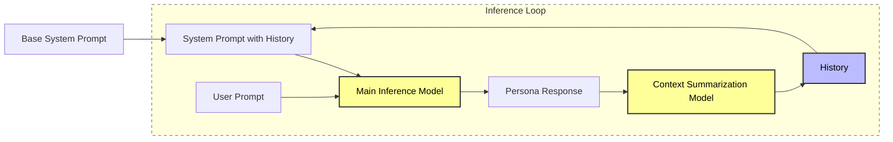

# History-LM
**Persona-Adaptive Dual-Model Framework for Local Memory Management**


## Features
- **Dual-Model Architecture**: Separates **Main Inference** and **Context Summarization** to maintain long-term memory without VRAM overflow.
- **Soft-Coded Personas**: Easily switch or add AI identities via `SystemPromptDict` without modifying core logic.
- **Memory Efficiency**: Optimized with 4-bit NF4 Quantization to run models on consumer-grade GPUs.
- **Infinite Context**: Automatically condenses dialogue history into a 3-sentence summary for every turn.
- **Hardware Requirements**: Requires CUDA-enabled GPU.
- **Models**: Meta-Llama-3.1-8B & Qwen-0.6B (Default Settings).

## Installation
```bash
pip install torch transformers bitsandbytes accelerate
```
