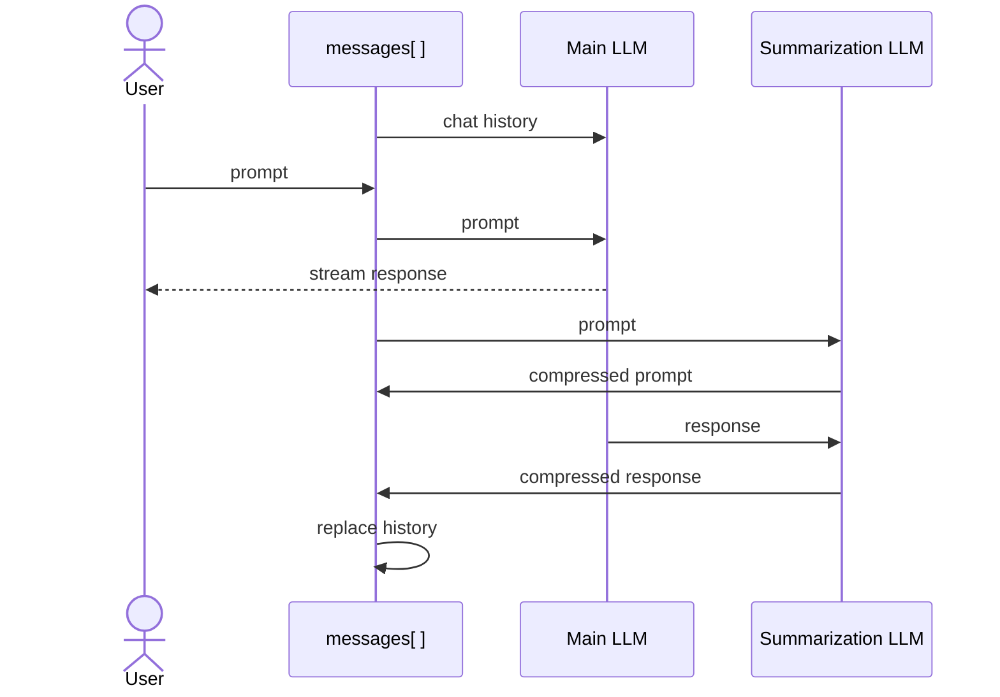

Terminal Chatbot that keeps conversation history **Compact**.

---
## How It Works


```mermaid
sequenceDiagram
    actor User
    participant Mem  as messages[ ]
    participant Main as Main LLM
    participant Summ as Summarization LLM


    Mem->>Main: chat history
    User->>Mem: prompt
    Mem->>Main: prompt
    Main-->>User: stream response
    Mem->>Summ: prompt
    Summ->>Mem: compressed prompt
    Main->>Summ: response
    Summ->>Mem: compressed response
    Mem->>Mem: replace history

```
1. The user sends prompt to the inference model.
2. The inference model generates the reply. The reply is passed to the user.
3. The compression model compacts the history to a caveman-style summary.
4. The chat history is replaced by the summarization.
---

## Configuration

Each model is driven by a JSON file, `MainModelInfo.json` and `SummModelInfo.json`.

| Field | Description |
|---|---|
| `model_id` | HuggingFace repo ID or local path |
| `max_new_tokens` | Token generation limit |
| `quantized` | `1`: 4-bit NF4, `0`: bfloat16 |
| `few_shots` | `1`: Prepend example pairs |
| `user_template` | `1`: Wrap user input with `{chat_input}` template |
| `tie_word_embeddings` | Passed to `from_pretrained` |
| `system_prompt` | Inserted at `messages[0]` |

**Defaults:** `meta-llama/Meta-Llama-3.1-8B-Instruct` (main) · `LiquidAI/LFM2.5-350M` (summarizer)

---
## Usage

```bash
pip install -r requirements.txt
```
Install the PyTorch build matching your CUDA.

```bash
python main.py
```

| Input | Action |
|---|---|
| Any text | Send to main model |
| `!break` | Exit |

---

## License

[MIT](LICENSE)

---

This project is NOT generated by an AI.  
