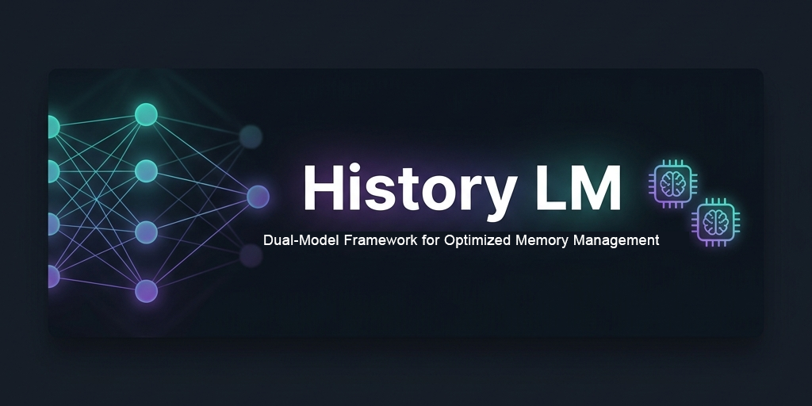
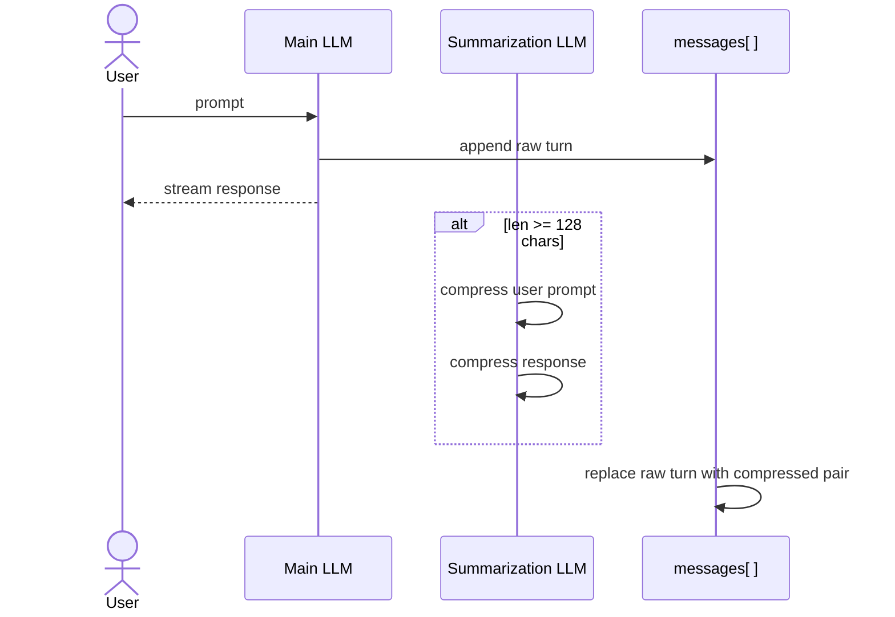

<div align="center">



<br/><br/>

<a href="https://www.python.org/"></a>
<a href="https://pytorch.org/"></a>
<a href="https://huggingface.co/docs/transformers"></a>
<a href="LICENSE"></a>

</div>

---

A terminal chatbot that keeps conversation history **compact**. A large inference model generates replies; a small compression model reduces each turn to a lossless caveman-style summary before it enters the message store.

---

## How It Works


```mermaid
sequenceDiagram
    actor User
    participant Main as Main LLM
    participant Summ as Summarization LLM
    participant Mem  as messages[ ]

    User->>Main: prompt
    Main->>Mem: append raw turn
    Main-->>User: stream response

    alt len >= 128 chars
        Summ->>Summ: compress user prompt
        Summ->>Summ: compress response
    end

    Mem->>Mem: replace raw turn with compressed pair
```

Every turn: generate → compress → replace.

---

## Configuration

Each model is driven by a JSON file — no code changes needed to swap models.

| Field | Description |
|---|---|
| `model_id` | HuggingFace repo ID or local path |
| `max_new_tokens` | Token generation limit |
| `quantized` | `1` → 4-bit NF4 · `0` → bfloat16 |
| `few_shots` | `1` → prepend example pairs to every user message |
| `user_template` | `1` → wrap user input with `{chat_input}` template |
| `tie_word_embeddings` | Passed to `from_pretrained`; model-specific |
| `system_prompt` | Inserted at `messages[0]` |

**Defaults:** `meta-llama/Meta-Llama-3.1-8B-Instruct` (main) · `LiquidAI/LFM2.5-350M` (summarizer)

To swap a model, edit `model_id` in `MainModelInfo.json` or `SummModelInfo.json`.

---

## Installation

```bash
pip install -r requirements.txt
```

> [!IMPORTANT]
> Install the PyTorch build matching your CUDA toolkit. See [pytorch.org/get-started/locally](https://pytorch.org/get-started/locally/).

---

## Usage

```bash
python main.py
```

| Input | Action |
|---|---|
| Any text | Send to main model |
| `!break` | Exit |

> [!WARNING]
> A CUDA-capable GPU is required. The program exits immediately if none is detected.

---

## License

[MIT](LICENSE)
